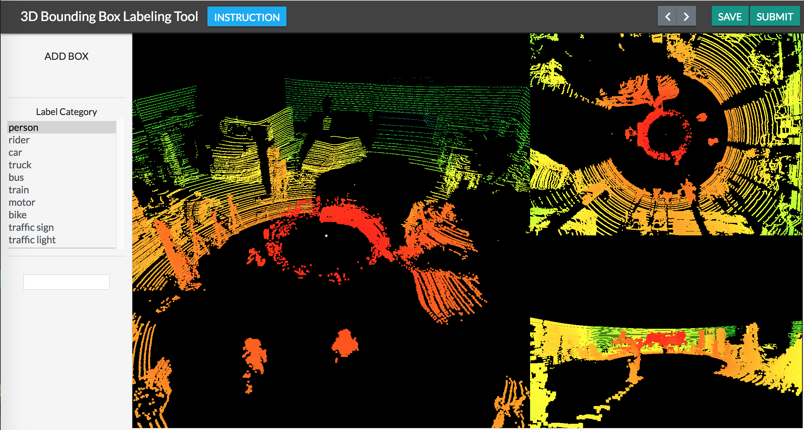
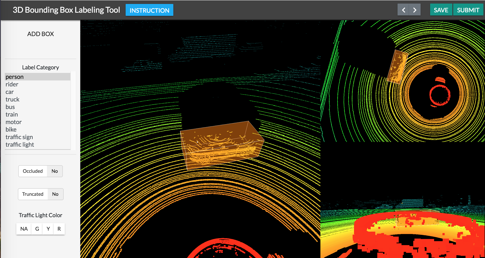

Point Cloud
===========

The creation of a point cloud project is the same as that of the other tools.

The format for the item/category/attribute files is the same too. Each url in the item file should return a JSON object containing a member "points" and a member "colors". The "points" member is either a "1d list of 3d points" or a 2d range image of 3d points. The "color" member has the same dimensions and shape as the "points" member and is the color to be rendered with each 3d point.

However, the tool requires some knowledge of shortcut keys. To go between items, there is a slider along with a << (previous)and a >> (next) button on the upper left of the window. To add a new bounding box, one needs to click on the "Add New Bounding Box" button located in the middle left of the screen. Afterwards, a small panel will appear below allowing the user to select the attributes and category associated with the label.

To change the size, position, and rotation of the bounding box, the box must first be selected by clicking on it or choosing it from the label list. Then, press "enter" button. Now, the user can change its position by simply clicking on it and moving the mouse around. To change the shape in the XY plane of the box, the user needs to press down s while dragging the box. To change the shape in the Z axis (the third dimension), the user can press e and repeat the same actions. To rotate, the user should press r and while clicking & dragging. Once done editing, the user can either press ESC or enter to leave the edit mode.

.. figure:: https://s3-us-west-2.amazonaws.com/scalabel-public/demo/videos/3d_bbox_0.2.gif

To save, simply press the save button on the upper right of the window.
