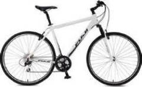

.. role:: red
.. role:: bold

Bounding Box Annotation
--------------------------------------------

1. Task

The task is to annotate bounding boxes around the following
objects as well their attributes (e.g. occluded, truncated, crowd,
color of the traffic light) :

2. Label Categories
~~~~~~~~~~~~~~~~~~~

+------------------+------------------------------------------------------------------------------------------------------------------------------------------------------------------------------------------------+
| :bold:`Category` | :bold:`Class`                                                                                                                                                                                  |
+------------------+------------------------------------------------------------------------------------------------------------------------------------------------------------------------------------------------+
| Human            | pedestrian, rider, other person                                                                                                                                                                |
+------------------+------------------------------------------------------------------------------------------------------------------------------------------------------------------------------------------------+
| Vehicle          | bicycle, bus, car, motorcycle, trailer, train, truck, van, other vehicle                                                                                                                       |
+------------------+------------------------------------------------------------------------------------------------------------------------------------------------------------------------------------------------+
| Object           | traffic light, traffic sign                                                                                                                                                                    |
+------------------+------------------------------------------------------------------------------------------------------------------------------------------------------------------------------------------------+

2.1 Human
===========

2.1.1 Pedestrian
########################

Examples are people
walking and standing. This class also includes toddlers standing
or walking on the ground, and someone pushing a
bicycle or standing next to it with both legs on the same side
of the bicycle. This class includes anything that is carried by
the person, e.g. backpack, but not items touching the ground,
e.g. trolleys.

.. figure:: ../media/instructions/bbox/person.png
    :width: 400px

2.1.2 Rider
########################

A human that would use some device to move a distance of 1m.
Includes, riders/drivers of bicycle, motorbike, scooter,
skateboards, horses, roller-blades, wheel-chairs, road cleaning
cars, cars without roof, baby carts. The vehicle that the rider
is on, such as bicycle, motorcycle, and scooter,  should be labeled separately.
However, do not label a visible driver of any car with roof.

.. figure:: ../media/instructions/bbox/rider.png
    :width: 400px

2.1.3 Other Person
########################

All other humans, for example a sitting person:

2.2 Vehicle
===========

2.2.1 Bicycle
########################

Bicycle with or without the rider

For a bicycle group, turn on the "crowd" attribute. Example:

2.2.2 Bus
########################

Bus for 9+ persons, public transport or long distance
transport.

.. figure:: ../media/instructions/bbox/bus.png
    :width: 400px

2.2.3 Car
########################

Sedan, convertible, coupe, or SUV with continuous body shape;
do not include trailers.

.. figure:: ../media/instructions/bbox/car.png
    :width: 400px

2.2.4 Motorcycle
########################

Motorbike, moped, or scooter with a seat. A scooter
without a seat should be annotated
as "other vehicle". Annotate the rider separately.

2.2.5 Trailer
###############################################################################

Trailers typically pulled by cars. Note that truck trailers are labeled truck.

.. figure:: ../media/instructions/seg/trailer1.png
    :width: 400px

.. figure:: ../media/instructions/seg/trailer4.png
    :width: 400px

In the first image: the trailer is towed by car, so it's trailer.

.. figure:: ../media/instructions/seg/trailer3.png
    :width: 400px

.. figure:: ../media/instructions/seg/trailer5.png
    :width: 400px

.. figure:: ../media/instructions/seg/trailer6.png
    :width: 400px

This one should be labeled as truck with a trailer:

.. figure:: ../media/instructions/seg/trailer2.png
    :width: 400px

2.2.6 Train
########################

2.2.7 Truck
########################

Truck, box truck, pickup truck. Including their trailers. Back
part / loading area is physically separated from driving
compartment.

.. figure:: ../media/instructions/bbox/truck.png
    :width: 400px

2.2.8 Van
###############################################################################

Box-shaped vehicle that is used to transport either people or goods, including MPV, 
caravans, and delivery vans.

.. figure:: ../media/instructions/seg/caravan.png
    :width: 400px

2.2.9 Other Vehicle
###############################################################################

All other forms of vehicles. For example, scooter, forklift, baby cart etc.

2.3 Object
===========

2.3.1 Traffic Sign
########################

Sign installed from the state/city authority, usually for information
of the driver/cyclist/pedestrian in an everyday traffic scene, e.g.
traffic- signs, direction signs - without their poles. No ads/commercial
signs. The front side and back side of a sign containing the information.
Note that commercial signs attached to buildings become building, attached
to poles or standing on their own become billboard.

.. figure:: ../media/instructions/bbox/traffic_sign.png
    :width: 300px

2.3.2 Traffic Light
########################

The traffic light box without its poles.

.. figure:: ../media/instructions/bbox/traffic_light.png
    :width: 300px

3. Label Attributes
~~~~~~~~~~~~~~~~~~~~

3.1 Occluded
============

An object annotated as "occluded" when one object is
hidden by another object. e.g. two persons walking
past each other, or a car that drives under a bridge or parks
behind another car.

Good example: annotate all visible parts of the object.

.. figure:: ../media/instructions/bbox/good_occluded_example.png
    :width: 600px

Bad example: missed some visible parts of the object.

.. figure:: ../media/instructions/bbox/bad_occluded_example.png
    :width: 600px

3.2 Truncated
=============

An object annotated as "truncated" indicates that the bounding
box specified for the object does not correspond to the full extent
of the object e.g. an image of a person from the waist up, or a
view of a car extending outside the image.

.. figure:: ../media/instructions/bbox/occluded_truncated_example.png
    :width: 600px

3.3 Traffic Light Color
=======================

For traffic lights, identify the color by selecting "G" (green),
"Y" (yellow), or "R" (red). If neither of the color applies, select
"NA".

3.4 Crowd
====================

Normally each label only contains one instance. However, if the
boundary between such instances cannot be clearly seen, the
whole crowd can labeled together. Turn the "crowd" attribute on
for crowd labels.

4. Basic Operations
~~~~~~~~~~~~~~~~~~~~

4.1 The Interface
=================
Category and attributes loaded during project creation are shown in the left sidebar.
The number of labels in the current image is shown on the left of the title bar.

4.1.1 Zoom in/out
##################################################
To zoom in/out, click the "+"/"-" buttons or the '+'/'-' keys.
 You can also zoom by scrolling while pressing the Ctrl key (Cmd for Mac users). You can
 drag the image around while pressing the Ctrl key (Cmd for Mac users).

.. figure:: ../media/docs/videos/2d_zoom-drag.gif
    :width: 600px

4.1.2 Saving and submitting
##################################################
To save the results of the current task, click "Save".
Always save the task before refreshing or leaving the annotation interface. Once done labeling each image of the
whole task, click Submit to indicate that the whole task is finished.

4.2 Bounding Box Detection Annotation
======================================

4.2.1 Create a bounding box
##################################################

Simply click and drag on the canvas to create a bounding box. On
the left sidebar, you can change the category and attributes of
a selected bounding box.

.. figure:: ../media/docs/videos/box2d_change.gif
    :width: 600px

4.2.2 Select, delete, and edit a bounding box
##################################################

Click on a bounding box to select the label, and press delete to
delete it. Drag the control points on the bounding box to resize
it. Please annotate the bounding box around the object as tight
as possible and only annotate visible part of the object.

.. figure:: ../media/docs/videos/box2d_select-delete.gif
    :width: 600px

5. Notice
~~~~~~~~~

* :red:`Always start labeling a bounding box in the FIRST frame of its occurrence. Otherwise you might need to start over.`

* Objects that are smaller than 7 * 7 pixel can be ignored. The bounding box smaller than 7 * 7 will turn grey and disappear when you finish.

* The remove operation is irreversible.
* Toggle the keyboard usage window by pressing '?'. Being familiar with the keyboard shortcuts can help you label much more efficiently.
* Zoom in with your browser to draw the bounding boxes more accurately. You can zoom in by pressing the '+'/'-' keys or scroll while pressing Ctrl (Cmd for Mac users). When zoomed in, you can drag the image around when pressing Ctrl (Cmd for Mac users).
* Hit Ctrl-H (Cmd-H for Mac users) to hide category label tags on the bounding boxes, and to show them after hitting Ctrl-H (Cmd-H for Mac users) again. Press the up/down arrow keys to bring a selected label forward/backward, and press the 'f'/'b' buttons to bring a selected label to front/back.
* If you refresh the page before saving, all previous history will not be saved.
* Report bugs and send questions to :bold:`bdd-label-help@googlegroups.com`.
