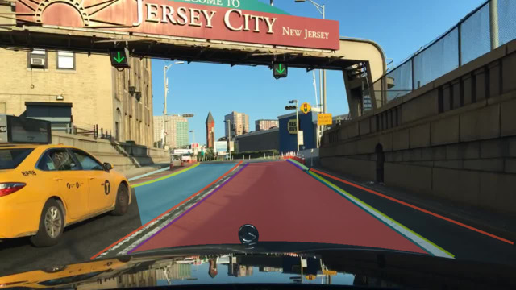
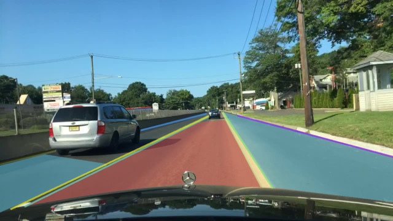
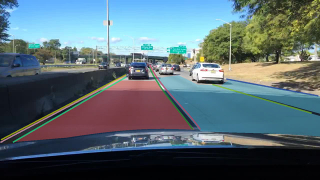
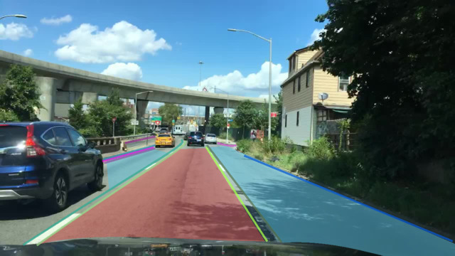
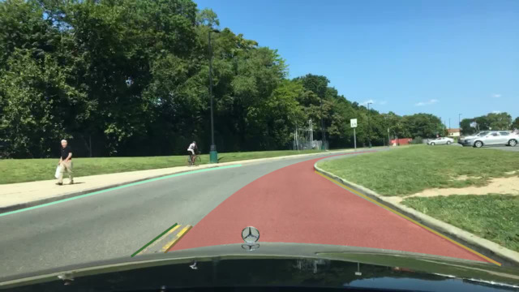
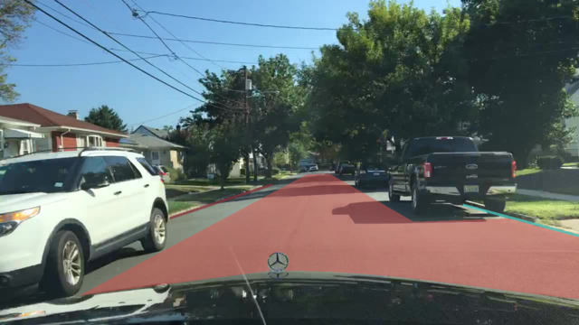

.. role:: red
.. role:: bold

Drivable Area
--------------------------------------------

1. Your Mission
~~~~~~~~~~~~~~~~~~~
Your mission is to annotate all drivable area. Definition of drivable area is specified in the following section.

2. Label Categories
~~~~~~~~~~~~~~~~~~~

The drivable area is divided into two different categories: **directly drivable area** and **alternatively drivable area**.

2.1 Directly Drivable Area
================================

In our dataset, **directly drivable area** defines the area on which the driver is currently driving – it is also the region where the driver has priority over other cars or the “right of the way”.

2.2 Alternatively Drivable Area
================================

In contrast, **alternatively drivable area** is a lane the driver is currently not driving on, but could do so –- via changing lanes.

In align with our understanding, on highway or city street, where traffic is closely regulated, drivable areas are mostly within lanes. However, in residential areas, the lanes are sparse. Annotators can judge what is drivable based on the surroundings.

3. Examples
~~~~~~~~~~~~~~~~~~~~

This section provides some examples of drivable areas. In the images provided in the section, **red** regions are directly drivable area and the **blue** ones are alternative drivable area.

As shown in the four images above, although drivable areas can be confined within lane markings, they are also related to locations of other vehicles.

.. figure:: ./image/drivable/drivable_07.jpg
    :width: 400px

.. figure:: ./image/drivable/drivable_08.jpg
    :width: 400px

These four images also show that some areas are perceptively drivable, even though no visible lane marking exists.

4. Notice
~~~~~~~~~~~~~~~~~~~~

* For details on specific labeling operations, please refer to the detailed instruction page on instance segmentations `here <https://www.scalabel.ai/doc/instructions/segmentation.html>`_.

* For details on other labeling types, please refer to `scalabel.ai/doc/ <https://www.scalabel.ai/doc/>`_  and `scalabel.ai/doc/instructions <https://www.scalabel.ai/doc/instructions/>`_ for more details and demos.

* Report bugs and send questions to :bold:`bdd-label-help@googlegroups.com`.
