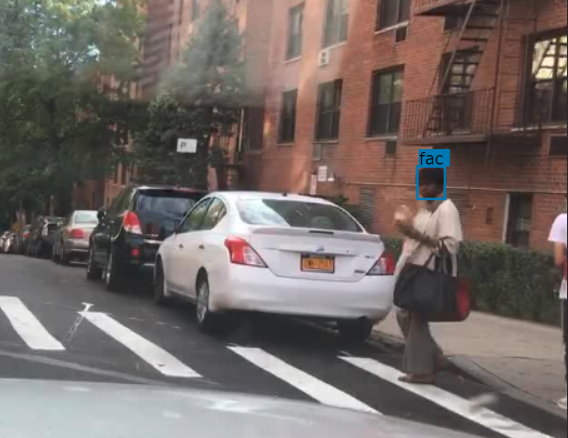
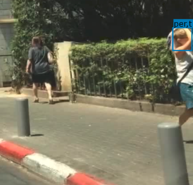

.. role:: red
.. role:: bold

Face Bounding Box Annotation
--------------------------------------------

1. Your Mission
~~~~~~~~~~~~~~~~
Your mission is to annotate bounding box around human faces as
well their attributes (e.g. occluded, truncated):

2. Label Categories
~~~~~~~~~~~~~~~~~~~

* Face

2 Face
===========

The face of a person to be labeled should satisfy the following criterion.
First of all, the face must be visible enough to be an identifying factor
for that person, so a person facing backwards need not be labeled (however,
we do need to label people facing sideways because their faces are visible).
Fit a bounding box around their face as in the example below.

3. Label Attributes
~~~~~~~~~~~~~~~~~~~~

3.1 Occluded
============

A face should be annotated as "occluded" when it is partially
hidden by another object, but the face is still identifying.

Example: annotate the entire face, even if partially blocked.

3.2 Truncated
=============

A face annotated as "truncated" indicates that the bounding
box specified for the face does not correspond to the full extent
of it e.g. a view of a person whose face extends outside the image.

4. Basic Operations
~~~~~~~~~~~~~~~~~~~~

4.1 The Interface
=================
Category and attributes loaded during project creation are shown in the left sidebar.
The number of labels in the current image is shown on the left of the title bar.

4.1.1 Zoom in/out
##################################################
To zoom in/out, click the "+"/"-" buttons or the '+'/'-' keys.
 You can also zoom by scrolling while pressing the Ctrl key (Cmd for Mac users). You can
 drag the image around while pressing the Ctrl key (Cmd for Mac users).

.. figure:: ../media/docs/videos/2d_zoom-drag.gif
    :width: 600px

4.1.2 Saving and submitting
##################################################
To save the results of the current task, click "Save".
Always save the task before refreshing or leaving the annotation interface. Once done labeling each image of the
whole task, click Submit to indicate that the whole task is finished.

4.2 Bounding Box Tracking Annotation
======================================

4.2.1 Create a bounding box
##################################################

Simply click and drag on the canvas to create a bounding box. On
the left sidebar, you can change the category and attributes of
a selected bounding box.

.. figure:: ../media/docs/videos/box2d_change.gif
    :width: 600px

4.2.2 Select, delete, and edit a bounding box
##################################################

Click on a bounding box to select the label, and press delete to
delete it. Drag the control points on the bounding box to resize
it. Please annotate the bounding box around the object as tight
as possible and only annotate visible part of the object.

.. figure:: ../media/docs/videos/box2d_select-delete.gif
    :width: 600px

5. Notice
~~~~~~~~~

* :red:`Always start labeling a bounding box in the FIRST frame of its occurrence. Otherwise you might need to start over.`

* Objects that are smaller than 7 * 7 pixel can be ignored. The bounding box smaller than 7 * 7 will turn grey and disappear when you finish.

* The remove operation is irreversible.
* Toggle the keyboard usage window by pressing '?'. Being familiar with the keyboard shortcuts can help you label much more efficiently.
* Zoom in with your browser to draw the bounding boxes more accurately. You can zoom in by pressing the '+'/'-' keys or scroll while pressing Ctrl (Cmd for Mac users). When zoomed in, you can drag the image around when pressing Ctrl (Cmd for Mac users).
* Hit Ctrl-H (Cmd-H for Mac users) to hide category label tags on the bounding boxes, and to show them after hitting Ctrl-H (Cmd-H for Mac users) again. Press the up/down arrow keys to bring a selected label forward/backward, and press the 'f'/'b' buttons to bring a selected label to front/back.
* If you refresh the page before saving, all previous history will not be saved.
* Report bugs and send questions to :bold:`bdd-label-help@googlegroups.com`.
