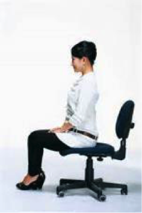
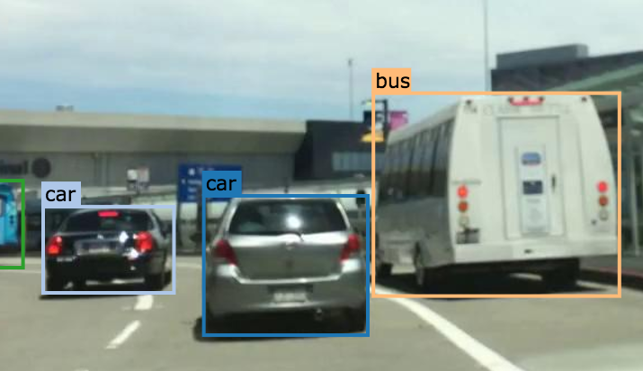
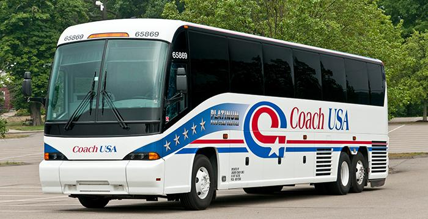
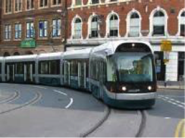
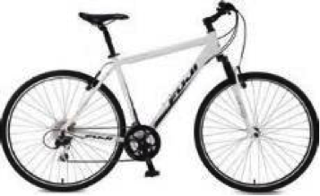
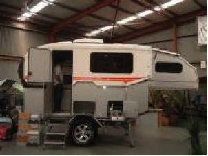
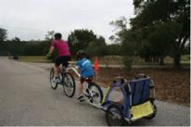
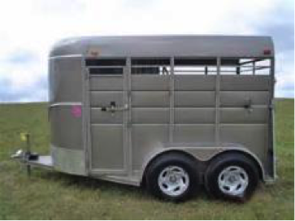
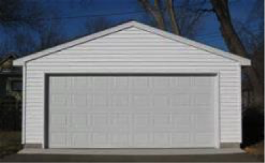

.. role:: red
.. role:: bold

Instance Segmentation
--------------------------------------------

1. Your Mission
~~~~~~~~~~~~~~~~
Your mission is to annotate segmentation labels of the following categories as well as their attributes.

2. Label Categories
~~~~~~~~~~~~~~~~~~~
With reference to: `Cityscapes <https://www.cityscapes-dataset.com/dataset-overview/#labeling-policy>`_,
there are also some newly added classes.

+------------------+------------------------------------------------------------------------------------------------------------------------------------------------------------------------------------------------+
| :bold:`Category` | :bold:`Class`                                                                                                                                                                                  |
+------------------+------------------------------------------------------------------------------------------------------------------------------------------------------------------------------------------------+
| Flat             | road, sidewalk, parking, rail track                                                                                                                                                            |
+------------------+------------------------------------------------------------------------------------------------------------------------------------------------------------------------------------------------+
| Human            | person, rider                                                                                                                                                                                  |
+------------------+------------------------------------------------------------------------------------------------------------------------------------------------------------------------------------------------+
| Vehicle          | car, truck, bus, train, motorcycle, bicycle, caravan, trailer                                                                                                                                  |
+------------------+------------------------------------------------------------------------------------------------------------------------------------------------------------------------------------------------+
| Construction     | building, bus stop, wall, fence, guard rail, bridge, tunnel, garage                                                                                                                            |
+------------------+------------------------------------------------------------------------------------------------------------------------------------------------------------------------------------------------+
| Object           | banner, billboard, fire hydrant, lane divider, mail box, parking sign, pole, street light, traffic cone, traffic device, traffic light, traffic sign, traffic sign frame, trash can            |
+------------------+------------------------------------------------------------------------------------------------------------------------------------------------------------------------------------------------+
| Nature           | vegetation, terrain                                                                                                                                                                            |
+------------------+------------------------------------------------------------------------------------------------------------------------------------------------------------------------------------------------+
| Sky              | sky                                                                                                                                                                                            |
+------------------+------------------------------------------------------------------------------------------------------------------------------------------------------------------------------------------------+
| Void             | dynamic, static, ground, ego vehicle                                                                                                                                                           |
+------------------+------------------------------------------------------------------------------------------------------------------------------------------------------------------------------------------------+

2.1 Flat
========

2.1.1 Road
###############################################################################

Part of ground on which cars usually drive, i.e. all lanes,
all directions, all streets. Including the markings on the road.
Areas only delimited by markings from the main road (no texture
change) are also road, e.g. bicycle lanes, roundabout lanes, or
parking spaces. This label does not include curbs.

2.1.2 Sidewalk
###############################################################################

Part of ground designated for pedestrians or cyclists.
Delimited from the road by some obstacle, e.g. curbs or poles
(might be small), not only by markings. Often elevated compared
to the road. Often located at the sides of a road. This label
includes a possibly delimiting curb, traffic islands (the
walkable part), or pedestrian zones (where usually cars are not
allowed to drive during day-time). As shown in the second picture below,
sidewalk in the middle of the road is still sidewalk.

2.1.3 Parking
###############################################################################

Parking lots and driveways. Not for regular driving, but rather
to park a vehicle. Different texture than road. In ambiguous
cases where the driveway is not separated from the sidewalk
(e.g. a building entrance), labeled as sidewalk.

.. figure:: ../media/instructions/seg/parking2.png
    :width: 400px

The second image should be considered sidewalk.

2.1.4 Rail Track
###############################################################################

All kind of rail tracks that are non-drivable by cars, e.g.
subway and train rail tracks, while tram rail tracks are usually
drivable by cars and therefore part of road.

.. figure:: ../media/instructions/seg/track2.png
    :width: 400px

2.2 Human
===========

2.2.1 Person
###############################################################################

A human that satisfies the following criterion. Assume the human
moved a distance of 1m and stopped again. If the human would
walk, the label is person, otherwise not. Examples are people
walking, standing or sitting on the ground, on a bench, on a
chair. This class also includes toddlers, someone pushing a
bicycle or standing next to it with both legs on the same side
of the bicycle. This class includes anything that is carried by
the person, e.g. backpack, but not items touching the ground,
e.g. trolleys.

.. figure:: ../media/instructions/seg/person1.png
    :width: 400px

2.2.2 Rider
###############################################################################

A human that would use some device to move a distance of 1m.
Includes, riders/drivers of bicycle, motorbike, scooter,
skateboards, horses, roller-blades, wheel-chairs, road cleaning
cars, cars without roof. Note that a visible driver of a car
with roof can only be seen through the window. Since holes are
not labeled, the human is included in the car label.

.. figure:: ../media/instructions/bbox/rider.png
    :width: 400px

2.3 Vehicle
===========

2.3.1 Car
###############################################################################

Car, jeep, SUV, small van with continuous body shape, caravan,
no other trailers.

2.3.2 Truck
###############################################################################

Truck, box truck, pickup truck. Including their trailers. Back
part / loading area is physically separated from driving
compartment.

.. figure:: ../media/instructions/bbox/truck.png
    :width: 400px

2.3.3 Bus
###############################################################################

Bus for 9+ persons, public transport or long distance
transport.

2.3.4 Train
###############################################################################

Vehicle on rails, e.g. tram, train.

2.3.5 Motorcycle
###############################################################################

Motorbike, moped, scooter without the driver (otherwise that's a rider,
see above)

.. figure:: ../media/instructions/seg/motor1.png
    :width: 400px

.. figure:: ../media/instructions/seg/motor2.png
    :width: 400px

.. figure:: ../media/instructions/seg/motor3.png
    :width: 400px

2.3.6 Bicycle
###############################################################################

Bicycle without the rider (otherwise that's a rider, see above)

2.3.7 Caravan
###############################################################################

Like truck, but back is primarily for living/sleeping. Including caravan trailers.

.. figure:: ../media/instructions/seg/caravan.png
    :width: 400px

2.3.8 Trailer
###############################################################################

Trailers typically pulled by cars. Note that truck trailers are labeled truck,
caravan trailers caravan, bicycle or horse trailers dynamic.

.. figure:: ../media/instructions/seg/trailer1.png
    :width: 400px

.. figure:: ../media/instructions/seg/trailer2.png
    :width: 400px

In the first image: the trailer is towed by car, so it's trailer. The second one
should be labeled as truck.

.. figure:: ../media/instructions/seg/trailer4.png
    :width: 400px

caravan

Horse trailer and bicycle trailer: dynamic.

2.4 Construction
==================

2.4.1 Building
###############################################################################

Building, skyscraper, house, bus stop building, garage, car port.
If a building has a glass wall that you can see through, the
wall is still building. Includes scaffolding attached to
buildings.

2.4.2 Bus Stop
###############################################################################

A bus stop is a designated place where buses stop for passengers
to board or alight from a bus.

.. figure:: ../media/instructions/seg/busstop.png
    :width: 400px

2.4.3 Wall
###############################################################################

Individual standing wall. Not part of a building.

2.4.4 Fence
###############################################################################

Fence including any holes.

2.4.5 Guard Rail
###############################################################################

All types of guard rails/crash barriers.

2.4.6 Bridge
###############################################################################

Only the bridge. Fences, people or vehicles on top are labeled separately.

2.4.7 Tunnel
###############################################################################

Tunnel wall and 'the dark'. No vehicles.

2.4.8 Garage
###############################################################################

.. figure:: ../media/instructions/seg/garage2.png
    :width: 400px

2.5 Object
============

2.5.1 Banner
###############################################################################

Sign installed from the state/city authority, usually for
information of the driver/cyclist/pedestrian in an everyday
traffic scene, e.g. traffic- signs, direction signs - without
their poles. No ads/commercial signs. The front side and back
side of a sign containing the information. Note that commercial
signs attached to buildings become building, attached to poles
or standing on their own become billboard.

.. figure:: ../media/instructions/seg/banner1.png
    :width: 400px

2.5.2 Billboard
###############################################################################

Sign installed from the state/city authority, usually for
information of the driver/cyclist/pedestrian in an everyday
traffic scene, e.g. traffic- signs, direction signs - without
their poles. No ads/commercial signs. The front side and back
side of a sign containing the information. Note that commercial
signs attached to buildings become building, attached to poles
or standing on their own become billboard.

.. figure:: ../media/instructions/seg/billboard2.png
    :width: 400px

.. figure:: ../media/instructions/seg/billboard3.png
    :width: 400px

2.5.3 Fire Hydrant
###############################################################################

A connection point by which firefighters can tap into a water supply.

.. figure:: ../media/instructions/seg/firehydrant.png
    :width: 200px

2.5.4 Lane Divider
###############################################################################

speed camera and other non-signal devices.

.. figure:: ../media/instructions/seg/divider1.png
    :width: 400px

.. figure:: ../media/instructions/seg/divider2.png
    :width: 400px

.. figure:: ../media/instructions/seg/divider3.png
    :width: 400px

2.5.5 Mail Box
###############################################################################

A physical box into which members of the public can deposit outgoing mail
intended for collection by the agents of a country's postal service. The term
can also refer to a private letter box for incoming mail.

.. figure:: ../media/instructions/seg/mailbox.png
    :width: 300px

2.5.6 Parking Sign
###############################################################################

speed camera and other non-signal devices.

.. figure:: ../media/instructions/seg/parkingsign3.png
    :width: 400px

2.5.7 Pole
###############################################################################

Small mainly vertically oriented pole. E.g. sign pole, traffic
light poles. If the pole has a horizontal part (often for
traffic light poles) this part is also considered pole. If there
are things mounted at the pole that are neither traffic light
nor traffic sign (e.g. street lights) and that have a diameter
(in pixels) of at most twice the diameter of the pole, then
these things might also be labeled pole. If they are larger,
they are labeled static.

Multiple poles that are cumbersome to label individually. If the gap between
two poles has at most as many pixels width as a single pole, you can label
the whole pole group with a single label with the "crowd" attribute on.

2.5.8 Street Light
###############################################################################

 As labeled in the second picture, only the light parts should be labeled as street light,
 the rest of the pole part should be labeled as pole.

.. figure:: ../media/instructions/seg/streetlight.png
    :width: 400px

2.5.9 Traffic Cone
###############################################################################

.. figure:: ../media/instructions/seg/cone.png
    :width: 400px

2.5.10 Traffic Device
###############################################################################

Speed camera and other non-signal devices.

.. figure:: ../media/instructions/seg/device1.png
    :width: 400px

.. figure:: ../media/instructions/seg/device2.png
    :width: 400px

2.5.11 Traffic Light
###############################################################################

The traffic light box without its poles.

2.5.12 Traffic Sign
###############################################################################

Sign installed from the state/city authority, usually for
information of the driver/cyclist/pedestrian in an everyday
traffic scene, e.g. traffic- signs, direction signs - without
their poles. No ads/commercial signs. The front side and back
side of a sign containing the information. Note that commercial
signs attached to buildings become building, attached to poles
or standing on their own become billboard.

.. figure:: ../media/instructions/seg/sign3.png
    :width: 400px

.. figure:: ../media/instructions/seg/sign4.png
    :width: 400px

2.5.13 Traffic Sign Frame
###############################################################################

speed camera and other non-signal devices.

.. figure:: ../media/instructions/seg/frame1.png
    :width: 400px

2.5.14 Trash Can
###############################################################################

2.6 Nature
=============

2.6.1 Vegetation
###############################################################################

Tree, hedge, all kinds of vertical vegetation. Plants attached to
buildings are usually not annotated separately and labeled
building as well. If growing at the side of a wall or building,
marked as vegetation if it covers a substantial part of the
surface (more than 20%).

2.6.2 Terrain
###############################################################################

Grass, all kinds of horizontal vegetation, soil or sand. These
areas are not meant to be driven on. This label includes a
possibly delimiting curb. Single grass stalks do not need to be
annotated and get the label of the region they are growing
on.

.. figure:: ../media/instructions/seg/terrain2.png
    :width: 400px

.. figure:: ../media/instructions/seg/terrain3.png
    :width: 400px

2.7 Sky
========

2.7.1 Sky
###############################################################################

Open sky, without leaves of tree. Includes thin electrical wires in front of the sky.

2.8 Void
===========

2.8.1 Dynamic
###############################################################################

Things that might not be there anymore the next day/hour/minute:
Movable trash bin, buggy, bag, wheelchair, animal.

2.8.2 Static
###############################################################################

Clutter in the background that is not distinguishable. Objects
that do not match any of the above. For example, visible parts
of the ego vehicle, mountains, street lights. Also rather small
regions in the image that are some of the classes above, but
that are cumbersome to label precisely might be annotated
static.

2.8.3 Ground
###############################################################################

All other forms of horizontal ground-level structures that do not
match any of the above. For example areas that cars and
pedestrians share all-day, roundabouts that are flat but
delimited from the road by a curb, elevated parts of traffic
islands, water. Void label for flat areas.

2.8.4 Ego Vehicle
###############################################################################

The vehicle that the camera is mounted on.

3. Label Attributes
~~~~~~~~~~~~~~~~~~~~

3.1 Occluded
============

An object annotated as "occluded" when one object is
hidden by another object. e.g. two persons walking
past each other, or a car that drives under a bridge or parks
behind another car.

Good example: annotate all visible parts of the object.

.. figure:: ../media/instructions/bbox/good_occluded_example.png
    :width: 600px

Bad example: missed some visible parts of the object.

.. figure:: ../media/instructions/bbox/bad_occluded_example.png
    :width: 600px

3.2 Truncated
=============

An object annotated as "truncated" indicates that the bounding
box specified for the object does not correspond to the full extent
of the object e.g. an image of a person from the waist up, or a
view of a car extending outside the image.

.. figure:: ../media/instructions/bbox/occluded_truncated_example.png
    :width: 600px

3.3 Traffic Light Color
========================

For traffic lights, identify the color by selecting "G" (green),
"Y" (yellow), or "R" (red). If neither of the color applies, select
"NA".

3.4 Crowd
====================

Normally each label only contains one instance. However, if the
boundary between such instances cannot be clearly seen, the
whole crowd can labeled together. Turn the "crowd" attribute on
for crowd labels.

4. Basic Operations
~~~~~~~~~~~~~~~~~~~~

4.1 The Interface
=================
Category and attributes loaded during project creation are shown in the left sidebar.
The number of labels in the current image is shown on the left of the title bar.

4.1.1 Jump between images
##################################################

go to the previous/next image by clicking the "<"/">" buttons,
or the left/right arrow keys. You can also edit the index of the image and hit "Enter" to jump to a specific image.

4.1.2 Zoom in/out
##################################################
To zoom in/out, click the "+"/"-" buttons or the '+'/'-' keys.
 You can also zoom by scrolling while pressing the Ctrl key (Cmd for Mac users). You can
 drag the image around while pressing the Ctrl key (Cmd for Mac users).

.. figure:: ../media/docs/videos/2d_zoom-drag.gif
    :width: 600px

4.1.3 Saving and submitting
##################################################
To save the results of the current task, click "Save".
Always save the task before refreshing or leaving the annotation interface. Once done labeling each image of the
whole task, click Submit to indicate that the whole task is finished.

4.2 Segmentation Annotation
============================

4.2.1 Draw a polygon
##################################################
Click on the image to start a label, and close the path to finish drawing a polygon.
Press 'd' to delete the latest vertex while drawing.

4.2.2 Edit a segmentation label
##################################################

* To make any change to a segmentation label (e.g. change category/attribute, delete, add/move vertex), select it first. Double-click on a segmentation label to select it, and single click on elsewhere deselects it. A selected label is filled with purple.

* Select the category/attribute in the left toolbar to change the category/attribute of the currently selected label.

* To move a vertex, select the category/attribute in the left toolbar to change the category/attribute of the currently selected label.

* To add a vertex on an edge, click the midpoint (drawn in white) to convert the midpoint into a vertex. You can then adjust the new vertex's position.

* To delete a vertex, click on the vertex while pressing 'd'.

* To convert straight edge to Bezier curve, click on the midpoint of the edge while pressing 'c'. Adjust the two control points to produce a tight-fitting curve. To recover a Bezier curve back to a straight edge, click on a control point of the curve while pressing 'c'.

.. figure:: ../media/docs/videos/seg2d_draw.gif
    :width: 600px

4.2.3 Link segmentation labels
##################################################

Sometimes objects can be divided into multiple parts in the image due to occlusion.
To link different polygons, select a segmentation label, and press Ctrl-L (Cmd-L for Mac users)
or the Link button to start linking. Single click on all labels that you want to link,
and hit Enter to finish linking.

.. figure:: ../media/docs/videos/seg2d_link.gif
    :width: 600px

4.2.4 Border Sharing with Quick Draw
##################################################

Quick Draw is a useful tool for border sharing. When drawing a segmentation label that
needs to share a border with an existing label, press Ctrl-D (Cmd-D for Mac users) or
the Quick Draw button to start Quick Draw mode. First select a polygon to share the border
with, and then select the starting vertex and the ending vertex of the shared border.
Press Alt to toggle between two possible shared paths. Hit Enter to end Quick Draw.

.. figure:: ../media/docs/videos/seg2d_quickdraw.gif
    :width: 600px

5. Notice
~~~~~~~~~

* Labels not identified in any category are treated as void (or in the case of license plate as the vehicle mounted on).

* Labeled foreground objects must never have holes, i.e. if there is some background visible 'through' some foreground object, it is considered to be part of the foreground. This also applies to regions that are highly mixed with two or more classes: they are labeled with the foreground class. Examples: tree leaves in front of house or sky (everything tree), transparent car windows (everything car).

* Labels with area less than 50 pixels are ignored (these small labels will be automatically deleted when closing a polygon).

* To edit a label occluded by another, try to move this label to front in order to select it. Press the up/down arrow key to move a label forward/backward, and press Ctrl-F/Ctrl-B (Cmd-F/Cmd-B for Mac users) to move a label to front/back.

* Toggle the keyboard usage window by pressing '?'. Being familiar with the keyboard shortcuts can help you annotate much more efficiently.

* Hit Ctrl-H (Cmd-H for Mac users) to hide category label tags on the bounding boxes, and to show them after hitting Ctrl-H (Cmd-H for Mac users) again.

* Note that the delete operation is not reversible.

* Below are some good and bad examples of the quality standard:
    Good:

    .. figure:: ../media/instructions/seg/good1.png
        :width: 600px

    .. figure:: ../media/instructions/seg/good2.png
            :width: 600px

    Bad:

    .. figure:: ../media/instructions/seg/bad1.png
        :width: 600px

    .. figure:: ../media/instructions/seg/bad2.png
        :width: 600px

* Report bugs and send questions to :bold:`bdd-label-help@googlegroups.com`.
