.. role:: red
.. role:: bold

Instance Segmentation Tracking
--------------------------------------------

1. Your Mission
~~~~~~~~~~~~~~~~
Your mission is to annotate segmentation tracking labels of the following categories as well as their attributes.

2. Label Categories
~~~~~~~~~~~~~~~~~~~
With reference to: `Cityscapes <https://www.cityscapes-dataset.com/dataset-overview/#labeling-policy>`_,
there are also some newly added classes.

+------------------+------------------------------------------------------------------------------------------------------------------------------------------------------------------------------------------------+
| :bold:`Category` | :bold:`Class`                                                                                                                                                                                  |
+------------------+------------------------------------------------------------------------------------------------------------------------------------------------------------------------------------------------+
| Human            | person, rider                                                                                                                                                                                  |
+------------------+------------------------------------------------------------------------------------------------------------------------------------------------------------------------------------------------+
| Vehicle          | car, truck, bus, train, motorcycle, bicycle, other                                                                                                                                             |
+------------------+------------------------------------------------------------------------------------------------------------------------------------------------------------------------------------------------+

2.1 Human
===========

2.1.1 Person
###############################################################################

A human that satisfies the following criterion. Assume the human
moved a distance of 1m and stopped again. If the human would
walk, the label is person, otherwise not. Examples are people
walking, standing or sitting on the ground, on a bench, on a
chair. This class also includes toddlers, someone pushing a
bicycle or standing next to it with both legs on the same side
of the bicycle. This class includes anything that is carried by
the person, e.g. backpack, but not items touching the ground,
e.g. trolleys.

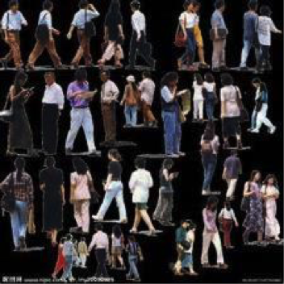

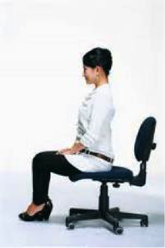

2.1.2 Rider
###############################################################################

A human that would use some device to move a distance of 1m.
Includes, riders/drivers of bicycle, motorbike, scooter,
skateboards, horses, roller-blades, wheel-chairs, road cleaning
cars, cars without roof. Note that a visible driver of a car
with roof can only be seen through the window. Since holes are
not labeled, the human is included in the car label.

.. figure:: ../media/instructions/bbox/rider.png
    :width: 400px

2.2 Vehicle
===========

2.2.1 Car
###############################################################################

Car, jeep, SUV, small van with continuous body shape, caravan,
no other trailers.

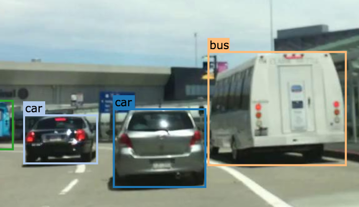

Caravans are also labeled as car. Caravan is like truck, but back is primarily
for living/sleeping. Including caravan trailers.

  .. figure:: ../media/instructions/seg/caravan.png
      :width: 400px

2.2.2 Truck
###############################################################################

Truck, box truck, pickup truck. Including their trailers. Back
part / loading area is physically separated from driving
compartment.

.. figure:: ../media/instructions/bbox/truck.png
    :width: 400px

2.2.3 Bus
###############################################################################

Bus for 9+ persons, public transport or long distance
transport.

.. figure:: ../media/instructions/bbox/bus.png
    :width: 400px

2.2.4 Train
###############################################################################

Vehicle on rails, e.g. tram, train.

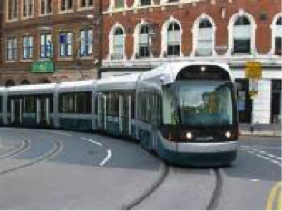

2.2.5 Motorcycle
###############################################################################

Motorbike, moped, scooter without the driver (otherwise that's a rider,
see above)

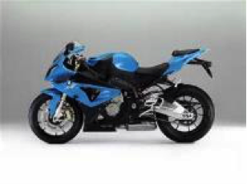

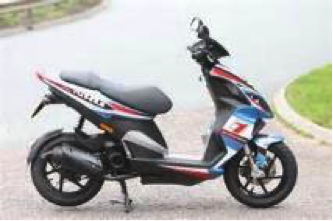

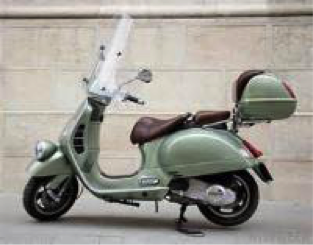

2.2.6 Bicycle
###############################################################################

Bicycle without the rider (otherwise that's a rider, see above)

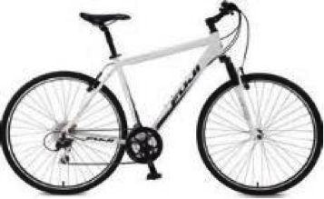

2.2.7 Other
###############################################################################

All other vehicles, for example trailer.

Trailers typically pulled by cars. Note that truck trailers are labeled truck,
caravan trailers other.

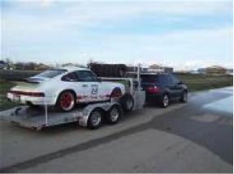

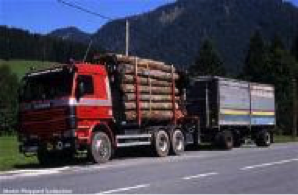

In the first image: the trailer is towed by car, so it's trailer. The second one
should be labeled as truck.

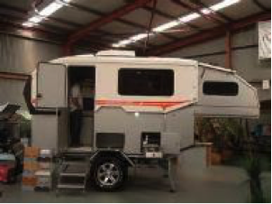

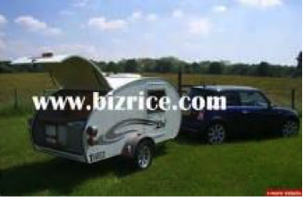

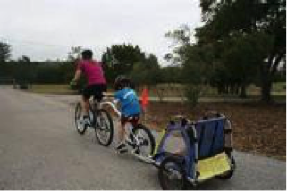

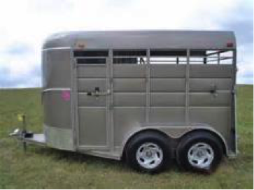

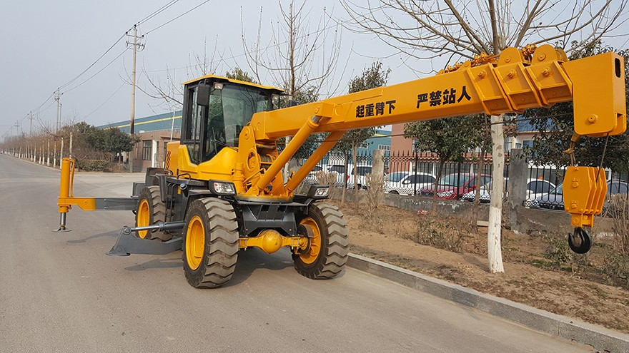

3. Label Attributes
~~~~~~~~~~~~~~~~~~~~

3.1 Occluded
============

An object annotated as "occluded" when one object is
hidden by another object. e.g. two persons walking
past each other, or a car that drives under a bridge or parks
behind another car.

Good example: annotate all visible parts of the object.

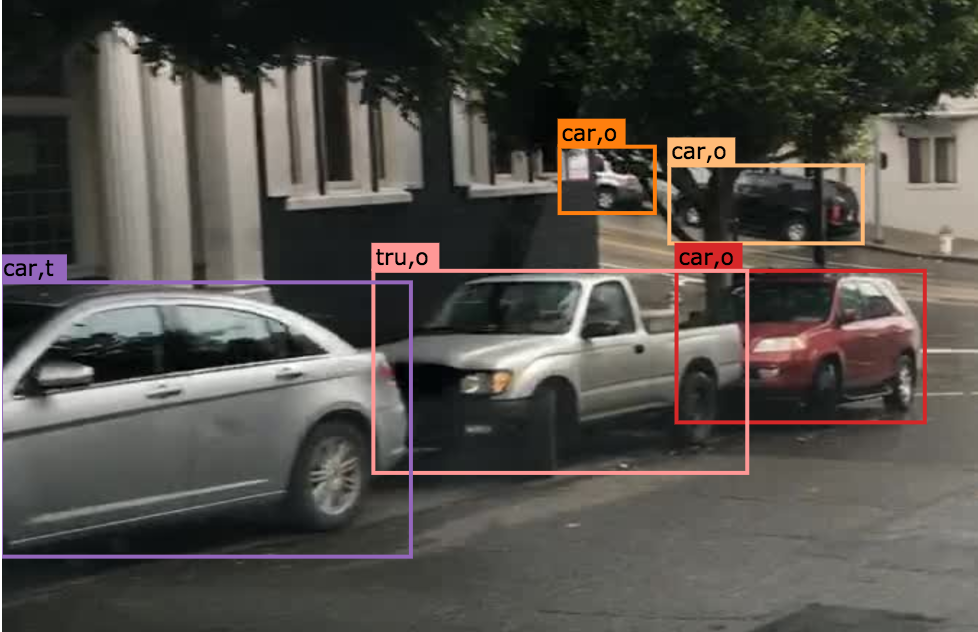

Bad example: missed some visible parts of the object.

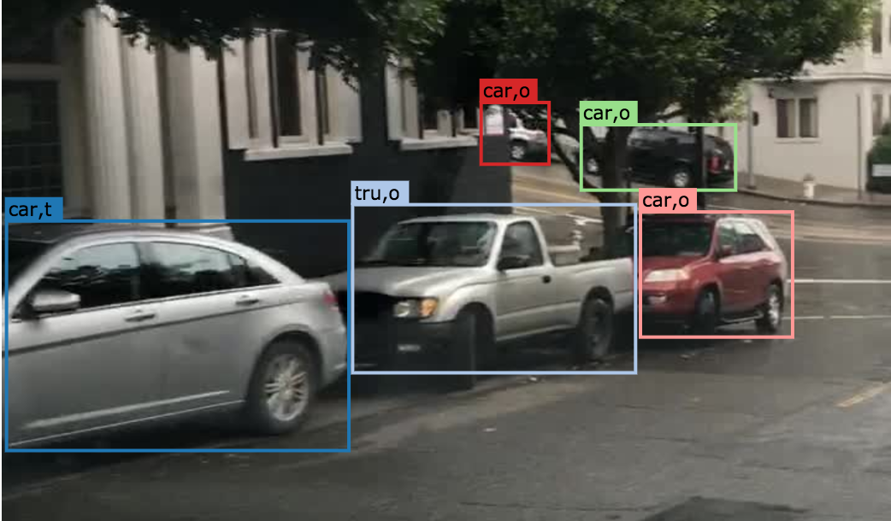

3.2 Truncated
=============

An object annotated as "truncated" indicates that the bounding
box specified for the object does not correspond to the full extent
of the object e.g. an image of a person from the waist up, or a
view of a car extending outside the image.

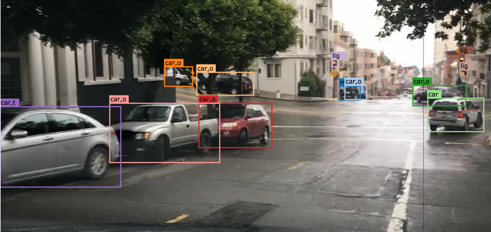

3.3 Traffic Light Color
========================

For traffic lights, identify the color by selecting "G" (green),
"Y" (yellow), or "R" (red). If neither of the color applies, select
"NA".

3.4 Crowd
====================

Normally each label only contains one instance. However, if the
boundary between such instances cannot be clearly seen, the
whole crowd can labeled together. Turn the "crowd" attribute on
for crowd labels.

4. Basic Operations
~~~~~~~~~~~~~~~~~~~~

4.1 The Interface
=================
Category and attributes loaded during project creation are shown in the left sidebar.
The number of labels in the current image is shown on the left of the title bar.

4.1.1 Jump between images
##################################################

go to the previous/next image by clicking the "<"/">" buttons,
or the left/right arrow keys. You can also edit the index of the image and hit "Enter" to jump to a specific image.

4.1.2 Zoom in/out
##################################################
To zoom in/out, click the "+"/"-" buttons or the '+'/'-' keys.
 You can also zoom by scrolling while pressing the Ctrl key (Cmd for Mac users). You can
 drag the image around while pressing the Ctrl key (Cmd for Mac users).

.. figure:: ../media/docs/videos/2d_zoom-drag.gif
    :width: 600px

4.1.3 Saving and submitting
##################################################
To save the results of the current task, click "Save".
Always save the task before refreshing or leaving the annotation interface. Once done labeling each image of the
whole task, click Submit to indicate that the whole task is finished.

4.2 Segmentation Annotation
============================

4.2.1 Draw a polygon
##################################################
Click on the image to start a label, and close the path to finish drawing a polygon.
Press 'd' to delete the latest vertex while drawing.

4.2.2 Edit a segmentation label
##################################################

* To make any change to a segmentation label (e.g. change category/attribute, delete, add/move vertex), select it first. Double-click on a segmentation label to select it, and single click on elsewhere deselects it. A selected label is filled with purple.

* Select the category/attribute in the left toolbar to change the category/attribute of the currently selected label.

* To move a vertex, select the category/attribute in the left toolbar to change the category/attribute of the currently selected label.

* To add a vertex on an edge, click the midpoint (drawn in white) to convert the midpoint into a vertex. You can then adjust the new vertex's position.

* To delete a vertex, click on the vertex while pressing 'd'.

* To convert straight edge to Bezier curve, click on the midpoint of the edge while pressing 'c'. Adjust the two control points to produce a tight-fitting curve. To recover a Bezier curve back to a straight edge, click on a control point of the curve while pressing 'c'.

.. figure:: ../media/docs/videos/seg2d_draw.gif
    :width: 600px

4.2.3 Link segmentation labels
##################################################

Sometimes objects can be divided into multiple parts in the image due to occlusion.
To link different polygons, select a segmentation label, and press Ctrl-L (Cmd-L for Mac users)
or the Link button to start linking. Single click on all labels that you want to link,
and hit Enter to finish linking.

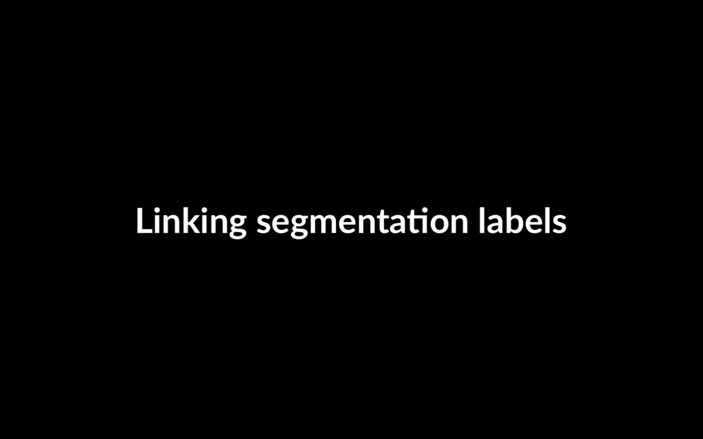

4.2.4 Border Sharing with Quick Draw
##################################################

Quick Draw is a useful tool for border sharing. When drawing a segmentation label that
needs to share a border with an existing label, press Ctrl-D (Cmd-D for Mac users) or
the Quick Draw button to start Quick Draw mode. First select a polygon to share the border
with, and then select the starting vertex and the ending vertex of the shared border.
Press Alt to toggle between two possible shared paths. Hit Enter to end Quick Draw.

.. figure:: ../media/docs/videos/seg2d_quickdraw.gif
    :width: 600px

4.3 Labeling Segmentation Tracks
================================

Start labeling a segmentation track at the :bold:`FIRST` frame of
its occurrence. When finish labeling the first frame, move the slider to subsequent frames to
adjust each vertex at each frame.

4.3.1 Move a segmentation label
##################################################

In a new frame, if adjusting individual vertices is laborious,
you can move the entire label by dragging the label while pressing 'm'.

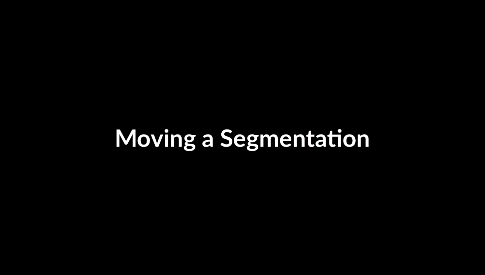

4.3.2 Redrawing a segmentation label
##################################################

In a new frame, sometimes it is easier to redraw the
entire segmentation label than adjusting each existing vertex. Press Ctrl-delete (Cmd-delete for
Mac users) to re-draw a segmentation label in the selected object track.

    .. figure:: ../media/docs/videos/seg2d_tracking_redraw.gif
        :width: 600px

4.3.3 Ending object track
##################################################

For an object that disappears after certain frame, click
"End Object Track" or press Ctrl-E (Cmd-E for Mac users) at the frame of its last occurrence.
The segmentation labels after this frame will be deleted. (Note: the video below demonstrates
ending a track for bounding box. The case for segmentation is the same.)

    .. figure:: ../media/docs/videos/box2d_tracking_end-track.gif
        :width: 600px

4.3.4 Track linking
##################################################

Sometimes an object reappears in the frame due to occlusion or
re-entrance, and track linking enables individual tracks to be linked as a single instance.
Select a label, click "Track-Link" or press Ctrl-L (Cmd-L for Mac users), and click on any other
tracks that you want to link with this label. The tracks you choose to link appears in dashed
lines. Click "Finish Track-Link" or hit Enter to finish this operation. (Note: the video below
demonstrates track linking for bounding box. The case for segmentation is the same.)

    .. figure:: ../media/docs/videos/box2d_tracking_track-link.gif
        :width: 600px

5. Notice
~~~~~~~~~

* :red:`Always start labeling a segmentation label in the FIRST frame of its occurrence. Otherwise you might need to start over.`

* Labels not identified in any category are treated as void (or in the case of license plate as the vehicle mounted on).

* Labeled foreground objects must never have holes, i.e. if there is some background visible 'through' some foreground object, it is considered to be part of the foreground. This also applies to regions that are highly mixed with two or more classes: they are labeled with the foreground class. Examples: tree leaves in front of house or sky (everything tree), transparent car windows (everything car).

* Labels with area less than 50 pixels are ignored (these small labels will be automatically deleted when closing a polygon).

* To edit a label occluded by another, try to move this label to front in order to select it. Press the up/down arrow key to move a label forward/backward, and press Ctrl-F/Ctrl-B (Cmd-F/Cmd-B for Mac users) to move a label to front/back.

* Toggle the keyboard usage window by pressing '?'. Being familiar with the keyboard shortcuts can help you annotate much more efficiently.

* Hit Ctrl-H (Cmd-H for Mac users) to hide category label tags on the bounding boxes, and to show them after hitting Ctrl-H (Cmd-H for Mac users) again.

* Note that the delete operation is not reversible.

* Below are some good and bad examples of the quality standard:
    Good:

    .. figure:: ../media/instructions/seg/good1.png
        :width: 600px

    .. figure:: ../media/instructions/seg/good2.png
            :width: 600px

    Bad:

    .. figure:: ../media/instructions/seg/bad1.png
        :width: 600px

    .. figure:: ../media/instructions/seg/bad2.png
        :width: 600px

* Report bugs and send questions to :bold:`bdd-label-help@googlegroups.com`.
